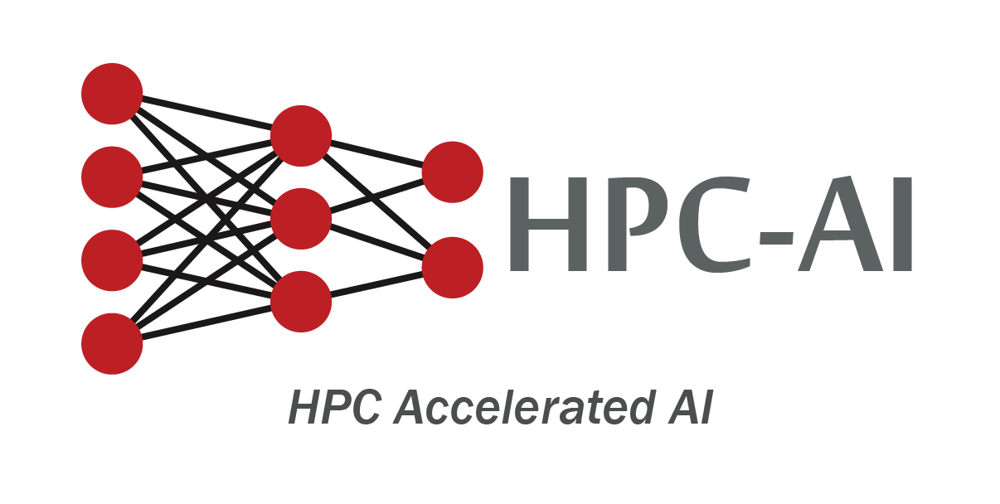
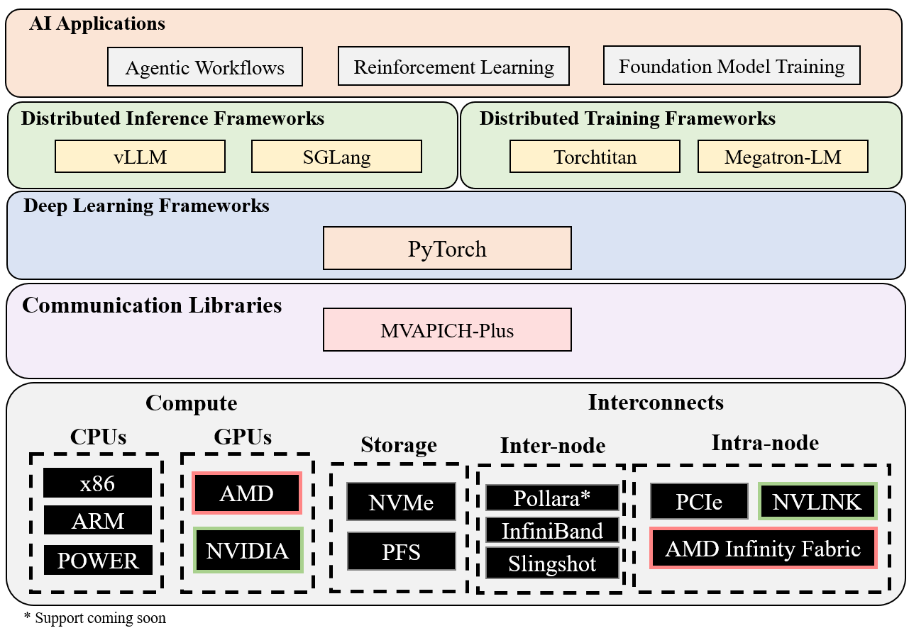
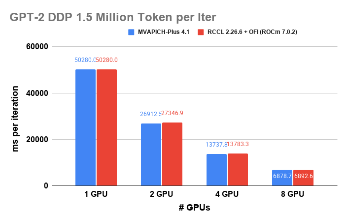
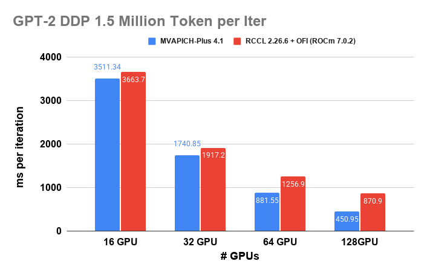
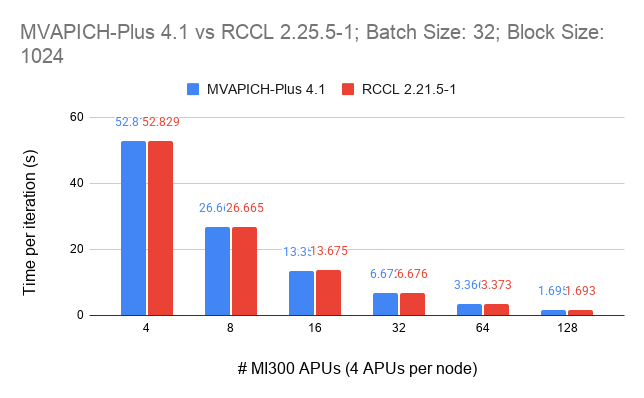
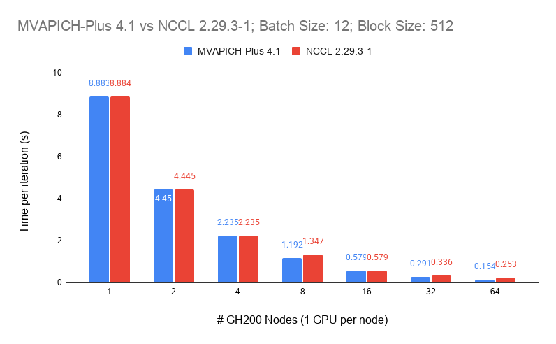

<p align="center">
  
</p>

# OSU HPC-AI Stack

[](https://opensource.org/licenses/Apache-2.0)

**High-Performance Inference and Deep Learning Stack**

This repository contains the NOWLAB high-performance deep learning stack, integrating CUDA-aware MPI libraries with state-of-the-art deep learning frameworks for distributed training and inference on HPC systems.

## Overview

The OSU HPC-AI stack provides:

- **CUDA-aware MPI**: [MVAPICH-Plus](http://mvapich.cse.ohio-state.edu/) for optimized GPU-to-GPU communication
- **Deep Learning Frameworks**: Custom builds of PyTorch, DeepSpeed, vLLM, and SGLang with MPI integration
- **Serving Methods**: MAC-Attention for reuse-based decode acceleration
- **Communication Runtime**: MCR-DL for modular, backend-agnostic distributed communication
- **Optimized Collective Operations**: GPUDirect RDMA support for high-performance distributed training
- **HPC-Ready**: Pre-configured for common HPC systems (MRI, Vista, etc.)

## Architecture

<p align="center">
  
</p>


## Repository Structure

```
osu-hpc-ai/
├── frameworks/              # Deep learning framework submodules
│   ├── pytorch/            # PyTorch 2.10.0 with MVAPICH-Plus
│   ├── deepspeed/          # DeepSpeed with ZeRO optimization
│   ├── sglang/             # SGLang structured generation
│   ├── vllm/               # vLLM high-throughput inference
│   └── mcr-dl/             # MCR-DL communication runtime
├── methods/                # Reusable method implementations
│   └── mac-attention/      # MAC-Attention source package and kernels
├── build_scripts/          # Automated build scripts
│   └── mri/               # MRI cluster-specific builds
├── docs/                   # Documentation
│   ├── build-guides/      # Framework build instructions
│   └── user-guides/       # Usage and method documentation
├── tests/                  # Installation verification tests
│   ├── pytorch/
│   ├── deepspeed/
│   ├── sglang/
│   ├── vllm/
│   └── mac-attention/
├── examples/               # Usage examples
│   ├── deepspeed/         # DeepSpeed training examples
│   ├── megatron-lm/       # Megatron-LM dummy training example
│   ├── inference/         # vLLM inference examples
│   └── mac-attention/     # MAC-Attention workflow example
├── benchmarks/             # Performance benchmarks
│   ├── communication/     # MPI communication benchmarks
│   └── mac-attention/     # MAC-Attention performance benchmarks
├── recipe/                 # End-to-end workflows
├── hpc_ai/                 # Python utilities package
├── setup_runtime_env.sh    # Runtime environment setup
└── README.md
```

## Quick Start

### Prerequisites

- **System**: HPC cluster with NVIDIA GPUs (Compute Capability ≥ 6.0)
- **CUDA**: Version 11.0+ (12.x recommended)
- **GCC**: Version 9.0+ (13.3.0 recommended)
- **Python**: Version 3.8-3.12

### Installation

#### Option 1: Pre-built Wheels (Recommended)

We provide pre-built wheels for common configurations:

```bash
# Visit https://hpc-ai.engineering.osu.edu for download instructions
# Registration required for pre-built wheel access

# pip install <wheel-url-provided-after-registration>
```

#### Option 2: Build from Source

```bash
# Clone the repository
git clone --recursive https://github.com/OSU-Nowlab/osu-hpc-ai.git
cd osu-hpc-ai

# Build PyTorch with MPI support
cd frameworks/pytorch
export USE_CUDA=1 USE_MPI=1
MAX_JOBS=4 python setup.py install
```

For detailed build instructions and system-specific guides, see:
- [PyTorch Build Guide](docs/build-guides/pytorch.md)
- [DeepSpeed Build Guide](docs/build-guides/deepspeed.md)
- [SGLang Build Guide](docs/build-guides/sglang.md)
- [vLLM Build Guide](docs/build-guides/vllm.md)
- [MAC-Attention Build Guide](docs/build-guides/mac-attention.md)
- [Megatron-LM Build Guide](docs/build-guides/megatron-lm.md)
- [verl Build Guide](docs/build-guides/verl.md)

For using distributed training with MPI:
- [PyTorch DDP with MPI Guide](docs/user-guides/pytorch-ddp.md)
- [DeepSpeed ZeRO Guide](docs/user-guides/deepspeed-zero.md)
- [vLLM Serving Guide](docs/user-guides/vllm-serving.md)
- [SGLang Structured Output Guide](docs/user-guides/sglang-structured.md)
- [MCR-DL Backend Guide](docs/user-guides/mcr-dl-backend.md)
- [MAC-Attention User Guide](docs/user-guides/mac-attention.md)
For troubleshooting and cluster-specific setup:
- [Troubleshooting Guide](docs/troubleshooting.md)
- [MRI Cluster Setup](docs/cluster-guides/mri-setup.md)
- [TACC Vista Setup](docs/cluster-guides/tacc-vista-setup.md)
- [OLCF Frontier Setup](docs/cluster-guides/olcf-frontier-setup.md)
- [SDSC Cosmos Setup](docs/cluster-guides/sdsc-cosmos-setup.md)

## Components

### MVAPICH-Plus

High-performance CUDA-aware MPI library with GPUDirect RDMA support.

- **Version**: 4.1+
- **Features**: CUDA/ROCm support, UCX backend, GPUDirect RDMA
- **Documentation**: [MVAPICH User Guide](http://mvapich.cse.ohio-state.edu/userguide/)

### PyTorch

NOWLAB fork with CUDA-aware MPI and FP16 communication.

- **Repository**: [OSU-Nowlab/pytorch](https://github.com/OSU-Nowlab/pytorch)
- **Documentation**: [Build Guide](docs/build-guides/pytorch.md)
- **Pre-built Wheels**: Available for registered users at [hpc-ai.engineering.osu.edu](https://hpc-ai.engineering.osu.edu)
- **Features**: MPI backend, GPUDirect RDMA

**Quick Example**:
```python
import torch
import torch.distributed as dist

# Initialize with MPI backend
dist.init_process_group(backend='mpi')

# Distributed training
model = torch.nn.parallel.DistributedDataParallel(model)
```

### DeepSpeed

Microsoft DeepSpeed with MVAPICH integration for ZeRO optimization.

- **Repository**: [OSU-Nowlab/DeepSpeed](https://github.com/OSU-Nowlab/DeepSpeed)
- **Features**: ZeRO stages, MPI communication backend

### vLLM

High-throughput LLM inference engine.

- **Repository**: [OSU-Nowlab/vllm](https://github.com/OSU-Nowlab/vllm)
- **Features**: PagedAttention, distributed inference

### SGLang

Structured generation language serving framework.

- **Repository**: [OSU-Nowlab/sglang](https://github.com/OSU-Nowlab/sglang)
- **Features**: RadixAttention, multi-GPU serving

### MAC-Attention

Reuse-based decode acceleration method for long-context inference.

- **Type**: Method, not a serving framework
- **Documentation**: [Build Guide](docs/build-guides/mac-attention.md), [User Guide](docs/user-guides/mac-attention.md)
- **Assets**: [Example](examples/mac-attention/README.md), [Benchmarks](benchmarks/mac-attention/README.md), [Tests](tests/mac-attention/README.md)
- **Current Status**: Imported method package and validation assets. Framework-level serving-path integration is still a separate step.

### Megatron-LM and verl

Experimental reinforcement learning validation path for running verl with Megatron-LM as the trainer and vLLM as the rollout engine on MRI.

- **Megatron-LM Documentation**: [Build Guide](docs/build-guides/megatron-lm.md), [Dummy Example](examples/megatron-lm/README.md)
- **Current Status**: Installation scripts, smoke tests, and a gated dummy recipe are present. The full dummy run still needs MRI GPU validation before production use.

## Building from Source

See our comprehensive guides:
- [Installation Guide](INSTALL.md) - Complete installation instructions
- Framework Build Guides - See [docs/build-guides/](docs/build-guides/) for DeepSpeed and SGLang

## Testing and Benchmarking

### Correctness Tests

Tests verify that operations produce correct results within tolerance:

```bash
# Run PyTorch MPI correctness test
cd tests/pytorch
mpirun -n 2 python test_mpi_comm.py
```

See [tests/README.md](tests/README.md) for more test suites.

### Performance Benchmarks

Benchmarks measure performance to detect regressions between releases:

```bash
# Run communication benchmarks
cd benchmarks/communication
mpirun -n 4 python run_all.py --scan
```

Individual operations can be benchmarked:
```bash
# Benchmark all_reduce with message size scanning
mpirun -n 4 python all_reduce.py --scan

# Benchmark specific operations
mpirun -n 4 python run_all.py --scan --all-reduce --broadcast
```

See [benchmarks/README.md](benchmarks/README.md) for more benchmarking options.

## Examples

### Distributed Training with PyTorch + MPI

```python
# examples/pytorch/distributed_training.py
import torch
import torch.distributed as dist
from torch.nn.parallel import DistributedDataParallel as DDP

# Initialize MPI backend
dist.init_process_group(backend='mpi')

# Create model
model = MyModel().cuda()
model = DDP(model)

# Training loop
for batch in dataloader:
    outputs = model(batch)
    loss = criterion(outputs, labels)
    loss.backward()
    optimizer.step()
```

Run with:
```bash
mpiexec -n 4 python examples/pytorch/distributed_training.py
```

### DeepSpeed Training

```bash
# ZeRO Stage 3 training
deepspeed --num_gpus=8 examples/deepspeed/train_gpt.py \
    --deepspeed_config=ds_config.json
```

### vLLM Inference

```python
from vllm import LLM, SamplingParams

llm = LLM(model="meta-llama/Llama-2-7b-hf", tensor_parallel_size=4)
outputs = llm.generate(prompts, sampling_params=params)
```

See [examples/](examples/) for more examples.

## Supported Systems

We officially support and test on:

| System | Architecture | GPUs | CUDA | Status |
|--------|-------------|------|------|--------|
| MRI Cluster | x86_64 | A100 | 12.6 | Supported |
| TACC Vista | ARM64 | GH200 | 12.5 | Supported |
| Generic HPC | x86_64 | V100+ | 11.0+ | Community |

## Performance

### PyTorch Distributed Data Parallel with MVAPICH-Plus

GPT-2 training performance using NanoGPT benchmark on leading HPC systems. MVAPICH-Plus provides competitive or superior performance compared to vendor-optimized communication libraries.

#### OLCF Frontier (AMD MI250X)

| CPU | Memory | GPU | Interconnect |
|-----|--------|-----|--------------|
| AMD EPYC 7A53 (64 cores @ 2GHz) | 512 GB DDR4 | AMD MI250X (4/Node, 128 GB HBM2e) | HPE Slingshot (200 Gb/s) |

**Benchmark**: GPT-2, Batch Size 12, Block Size 1024, PyTorch 2.10.0

<p align="center">
  
  
</p>

#### SDSC Cosmos (AMD CDNA3 APU)

| CPU | Memory | GPU | Interconnect |
|-----|--------|-----|--------------|
| x86_64 (96 cores @ 3.7GHz) | 512 GB HBM3 unified | Integrated CDNA3 (128 GB HBM3/APU) | HPE Cray Slingshot-11 (200 Gb/s) |

**Benchmark**: GPT-2, Batch Size 32, Block Size 1024, PyTorch 2.10.0

<p align="center">
  
</p>

#### TACC Vista (NVIDIA GH200)

| CPU | Memory | GPU | Interconnect |
|-----|--------|-----|--------------|
| NVIDIA Grace (72 cores @ 3.1GHz) | 116 GB DDR5 | NVIDIA H200 (1/Node, 96 GB HBM3) | Mellanox NDR (400 Gb/s) |

**Benchmark**: GPT-2, Batch Size 12, Block Size 512, Gradient Accumulation 256, PyTorch 2.10.0

<p align="center">
  
</p>

For more performance results, visit [Here](https://hpc-ai.engineering.osu.edu/performance/pytorch-ddp-gpu/).

## Citation

If you use this software in your research, please cite:

```bibtex
@software{osu_hidl,
  title = {OSU HPC-AI: High-Performance Inference and Deep Learning Stack},
  author = {Network-Based Computing Laboratory, The Ohio State University},
  url = {https://github.com/OSU-Nowlab/osu-hpc-ai},
  year = {2025},
  license = {Apache-2.0}
}
```

## Contributing

We welcome contributions from the community! Please see our [Contributing Guide](CONTRIBUTING.md) for details on:

- Development setup
- Code style guidelines
- Testing requirements
- Pull request process

By contributing, you agree that your contributions will be licensed under the [Apache License 2.0](LICENSE).

## License

This project is licensed under the Apache License 2.0 - see [LICENSE](LICENSE) file.

Individual components may have additional licenses:
- PyTorch: BSD-3-Clause (see `frameworks/pytorch/LICENSE`)
- DeepSpeed: Apache-2.0 (see `frameworks/deepspeed/LICENSE`)
- vLLM: Apache-2.0 (see `frameworks/vllm/LICENSE`)
- SGLang: Apache-2.0 (see `frameworks/sglang/LICENSE`)

## Support

- **Website**: [https://hpc-ai.engineering.osu.edu](https://hpc-ai.engineering.osu.edu)
- **GitHub Issues**: [Report bugs and request features](https://github.com/OSU-Nowlab/osu-hpc-ai/issues)
- **Contact**: Visit the HPC-AI website for support and contact information

---

**NOWLAB** | The Ohio State University | [nowlab.cse.ohio-state.edu](http://nowlab.cse.ohio-state.edu/)
